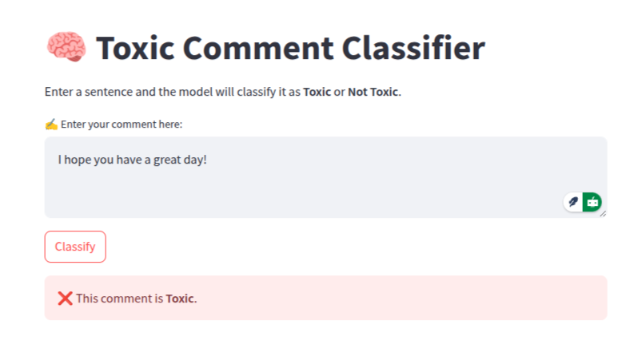
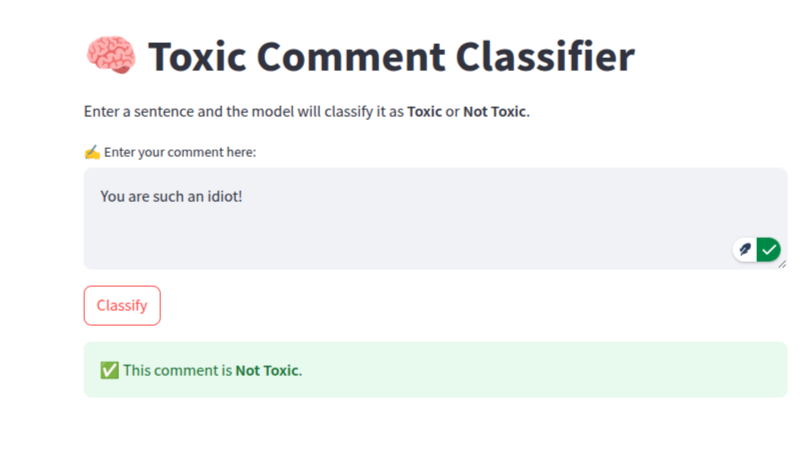

# 🧠 A7_NLP-Assignment: Distillation vs LoRA

This project is part of the **AT82.05 - Artificial Intelligence: Natural Language Understanding (NLU)** course assignment. It compares **Distillation (Odd vs Even Layer Student Training)** and **LoRA (Low-Rank Adaptation)** for toxic comment classification using BERT-based models. It also includes a **Streamlit web application** for real-time prediction.

---

## 📌 Project Structure

```
A7_NLP-Assignment/
├── A7.ipynb                        # Main Jupyter Notebook (Tasks 1–4)
├── webapp.py                       # Streamlit app (Task 5)
├── student_lora/                   # LoRA adapter folder
│   ├── adapter_config.json
│   └── adapter_model.safetensors
├── results/                        # Evaluation screenshots
│   └── Screenshot_*.png
├── README.md                       # This file
```

---

## 📊 Tasks Overview

| Task | Description |
|------|-------------|
| ✅ Task 1 | Load and prepare a hate speech / toxic comment dataset |
| ✅ Task 2 | Train a 6-layer student using odd `{1,3,5,7,9,11}` and even `{2,4,6,8,10,12}` teacher layers |
| ✅ Task 3 | Fine-tune the student model using **LoRA** |
| ✅ Task 4 | Evaluate and compare all models on test data |
| ✅ Task 5 | Build a **web application** to classify input as toxic or not |

---

## 📥 Dataset

I use the [Hate Speech and Offensive Language Dataset](https://github.com/t-davidson/hate-speech-and-offensive-language), which contains over 24k tweets labeled as hate speech, offensive language, or neither. Labels are converted into binary: `1 = toxic`, `0 = not toxic`.

---

## 🧠 Model Types

| Model      | Method         | Layers Used                     |
|------------|----------------|----------------------------------|
| Odd Layer  | Distillation   | Teacher layers `{1,3,5,7,9,11}` |
| Even Layer | Distillation   | Teacher layers `{2,4,6,8,10,12}`|
| LoRA       | Adapter-based  | Full 12-layer model w/ LoRA     |

---

## 📈 Results

| Model       | Accuracy | Precision | Recall | F1 Score |
|-------------|----------|-----------|--------|----------|
| Odd Layer   | 0.168    | 0.0       | 0.0    | 0.0      |
| Even Layer  | 0.832    | 0.832     | 1.0    | 0.908    |
| **LoRA**    | 0.824    | 0.831     | 0.989  | 0.903    |

## 💬 Task 4.2: Discussion – Distillation vs LoRA

### 📉 Challenges Faced

During the implementation of knowledge distillation for the Odd and Even Layer student models, several issues emerged:

- **Imbalanced Student Performance**: The Odd Layer model performed extremely poorly (Accuracy = 0.168, F1 = 0.0), failing to learn meaningful patterns from the teacher. In contrast, the Even Layer student reached high performance, suggesting that certain layers (e.g., `{2,4,6,8,10,12}`) carry more transferable knowledge than others.
- **Sensitivity to Layer Selection**: Mapping student layers to teacher layers is highly sensitive. A poor mapping (as seen with Odd layers) can result in underfitting or ineffective learning.
- **No Supervised Signal in Distillation**: Unlike LoRA, distillation training didn't use the actual labels during training — only MSE loss between hidden states. This limited its ability to correct mistakes or generalize.

### ✅ LoRA Strengths

- **Fine-tuned with Labels**: LoRA was trained with true labels and cross-entropy loss, leading to better generalization and more reliable performance (F1 = 0.903).
- **Training Efficiency**: LoRA fine-tuning was faster and more memory-efficient since it modified only a small number of parameters.
- **Stable Results**: The LoRA model showed consistent performance across toxic and non-toxic samples.

### 🔧 Suggested Improvements

- For **Distillation**:
  - Use a **hybrid approach**: Combine MSE (hidden state) loss with supervised loss (cross-entropy) to improve learning.
  - Perform **layer-wise correlation analysis** to choose the most informative layers for student mapping.
  - Add **intermediate supervision** (e.g., matching logits or attention maps) instead of just hidden states.

- For **LoRA**:
  - Try larger `r` values or more target modules (like `query`, `value`, `key`) to increase learning capacity.
  - Combine LoRA with quantization for deployment optimization.

---

> 💡 Based on the results, **Even Layer Distillation** and **LoRA** both perform well, but **LoRA** offers better training simplicity and stability — making it the more practical choice in most scenarios.

📷 See the [`results/`](results/) folder for screenshots of predictions and evaluation logs.

---

## 🌐 Web App (Task 5)

A minimal **Streamlit-based web app** to classify text as **toxic** or **not toxic** using the fine-tuned **LoRA model**.

### ▶️ Run the app locally:

```bash
pip install -r requirements.txt
streamlit run webapp.py
```

### 📷 Screenshot




---

## 🧪 Test Examples

Try these in the app:

- `"I hate you!"` → ⚠️ **Toxic**
- `"You're awesome, have a nice day!"` → ✅ **Not Toxic**

---

## ⚙️ Requirements

```text
torch>=2.1.0
transformers>=4.36.2
peft>=0.7.1
streamlit
scikit-learn
```

Install them via:

```bash
pip install -r requirements.txt
```

---

## ✍️ Author

- 👨‍🎓 Student ID: **PK_124960**
- 📅 Assignment Due: 24 March 2025
- 📘 Course: AT82.05 - Artificial Intelligence: NLU

---

## 📚 References

- [Davidson et al., 2017 Hate Speech Dataset](https://github.com/t-davidson/hate-speech-and-offensive-language)
- [Hugging Face Transformers](https://huggingface.co/transformers/)
- [PEFT (LoRA Library)](https://github.com/huggingface/peft)

---

> 📌 *This assignment was completed as part of an academic course and is not intended for production use.*
